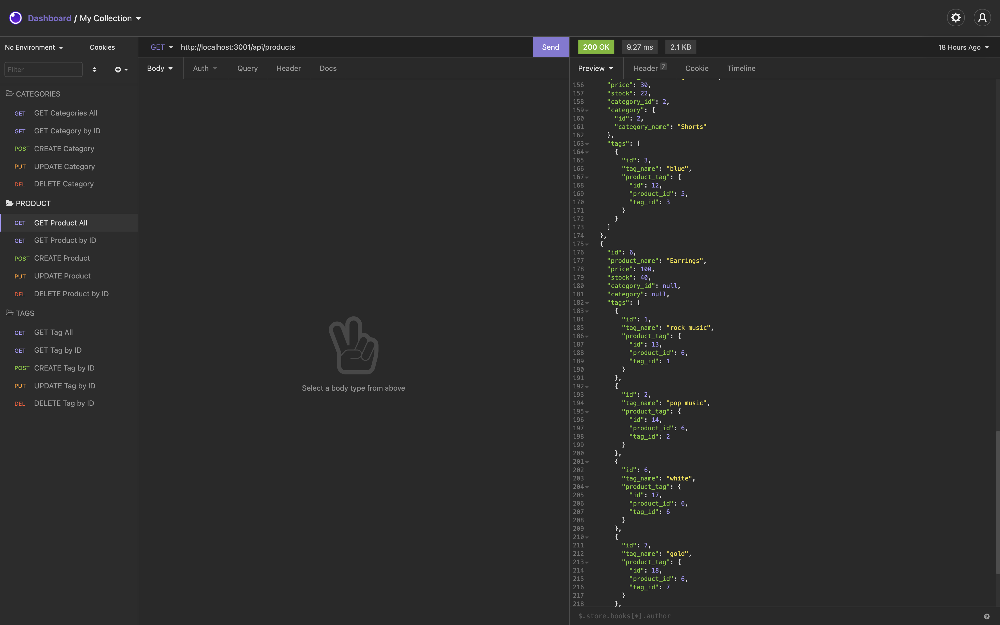

# E-commerce Back End
unlicensed
    
## Description
This project creates the back end for an e-commerce site. It uses and  Express.js API configured to use Sequelize to interact with a MySQL database.  
[project link](https://github.com/gfernandez25/e-commerce-back-end)

## Table Of Contents
* [Installation](#user-content-installation)
* [Usage](#user-content-usage)
* [Licenses](#user-content-licenses)
* [Tests](#user-content-tests)
* [Questions](#user-content-questions)
    
## Installation
1. install MySQL2
2. install Sequelize
3. install the dotenv package
4. use the schema.sql file in the db folder to create your database using MySQL shell commands - source db/schema.sql
5. run npm run seed to seed data to your database 
6. run to following command to start the express server npm run start 
7. routes can be tested with imsomnia core or browser window

## Usage
Please see walk through video

[how to video](https://drive.google.com/file/d/16ucWXFki8Kr-HA13yySmfgAIWItfW8xX/view)
## Screenshot

Routes can be tested on Heroku.
https://obscure-tundra-07551.herokuapp.com/api/categories

## License

unlicensed
    
## Contributing
contribute as you can
 
## Tests
manual test only

## Questions
for any questions please check out my GitHub profile: [gfernandez25](https://github.com/gfernandez25)  

